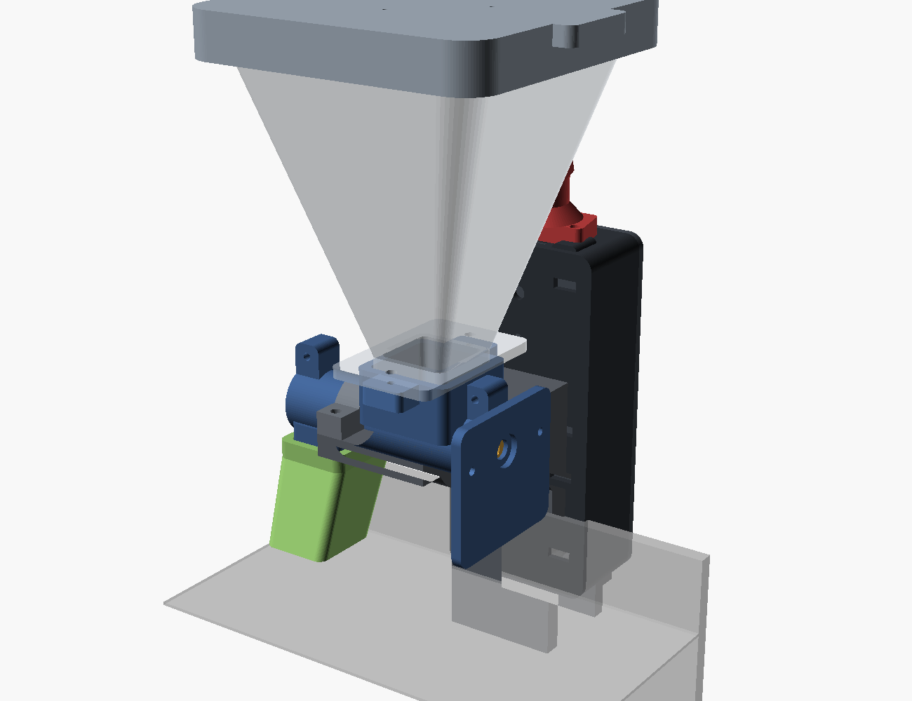
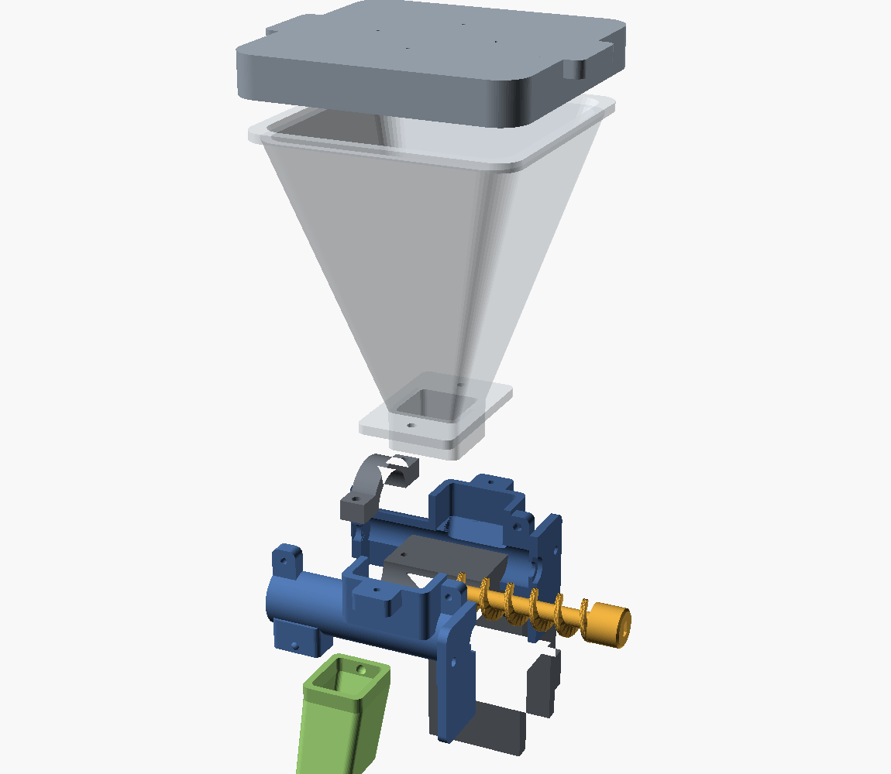
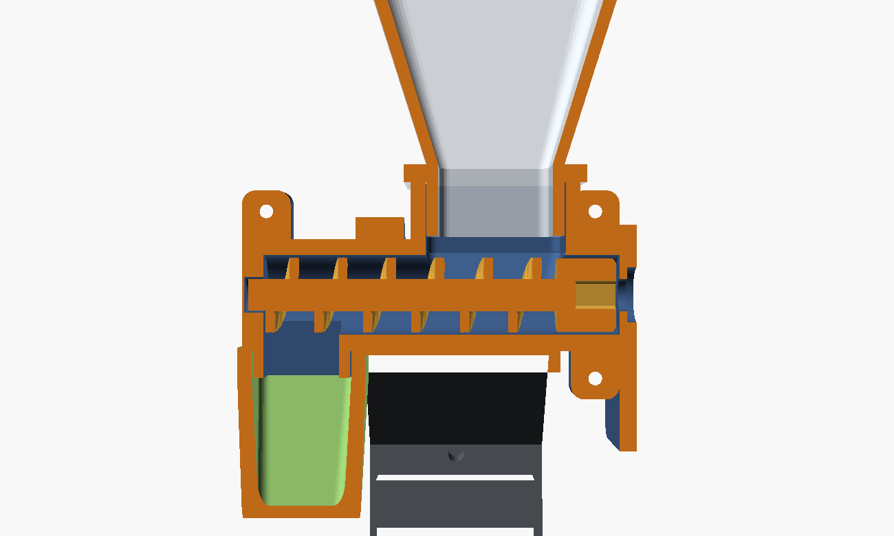
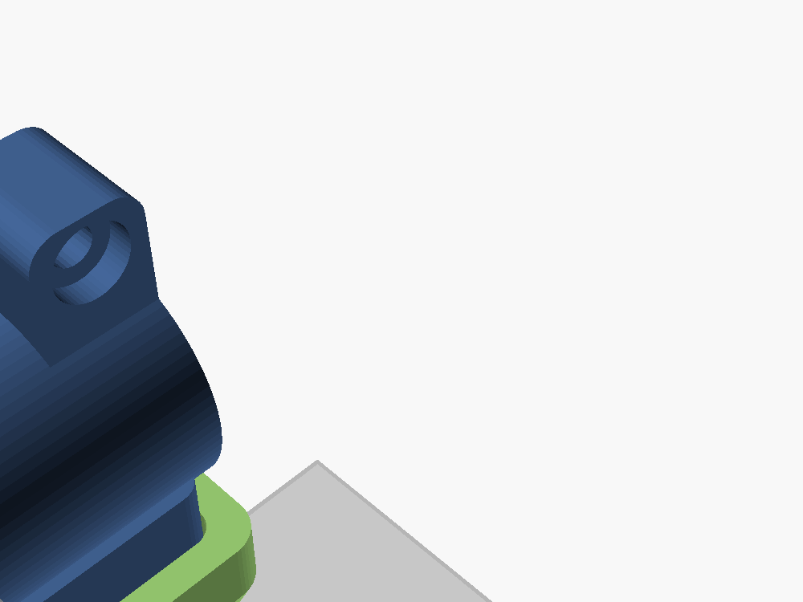

# AquaFeeder ESP32-S3

Alimentador automático de aquário com **agenda de horários**, **acionamento manual
de qualquer lugar** e **câmera** para conferir se está tudo bem. Todas as peças
são impressas em 3D e o firmware roda num ESP32-S3.

### 📖 [Guia de montagem](https://gilson-android.github.io/alimentador/) · 🔌 [Referência da API](https://gilson-android.github.io/alimentador/api.html)

O site é o mesmo conteúdo desta documentação, mas navegável, com seletor de motor,
calculadora de dose, checklist de viagem e gerador de comandos da API.



## O que ele faz

| Recurso | Como |
|---|---|
| Agenda | Até 8 horários, dias da semana e porções por horário |
| Alimentar agora | Botão na interface web, comando no Telegram ou o botão BOOT da placa |
| Câmera | Foto sob demanda + vídeo ao vivo (MJPEG) na interface |
| Fora de casa | Bot do Telegram (`/alimentar`, `/foto`, `/status`) — sem abrir porta no roteador |
| Não perde refeição | Se faltar luz na hora marcada, recupera quando voltar (janela configurável) |
| Anti-entupimento | Recua a rosca antes de cada dose; sensor de grãos opcional avisa se nada caiu |
| Trava de segurança | Limite de porções por dia, por acionamento e intervalo mínimo |
| Atualização | OTA pela rede depois da primeira gravação |

## Como funciona a mecânica

Funil de ~300 ml → **rosca sem-fim (auger)** girada por um motor de passo
28BYJ-48 → a ração cai por uma calha inclinada acima da água.

Rosca sem-fim é o mecanismo certo aqui: a dose é proporcional ao ângulo de giro
(dá para dosar 0,2 ml), o tubo cheio de ração veda a passagem de umidade, e o
motor de passo trava sozinho quando parado. Uma volta completa entrega ~0,9 ml;
a porção padrão é **1/4 de volta ≈ 0,23 ml**, ajustável na interface.

> A rosca funciona muito bem com **ração granulada/peletizada de até ~3 mm**.
> Com ração em flocos grandes ela pode enroscar — quebre os flocos ou use
> granulado. Ver [docs/05-calibracao.md](docs/05-calibracao.md).

## Ver o projeto montado em 3D

Dois arquivos servem só para você olhar (**não são para imprimir**):

- `stl/montagem_completa.stl` — o conjunto inteiro já montado
- `stl/montagem_explodida.stl` — as peças separadas, para entender a ordem de montagem

Abra do jeito que preferir:

- duplo clique no Windows → abre no **Visualizador 3D**;
- arraste para o **Creality Print** (ou qualquer fatiador);
- ou jogue em https://viewstl.com, sem instalar nada.

Para girar as peças, esconder o funil, ver em corte ou explodido, abra
`cad/assembly.scad` no OpenSCAD e mexa nas chaves do topo do arquivo
(`CUTAWAY`, `EXPLODE`, `SHOW_HOPPER`, `SHOW_BOX`, `SHOW_TANK`).

| | |
|---|---|
|  |  |
| Montado no aquário | Explodido |
|  |  |
| Corte no meio do tubo | O que a câmera enquadra |

## Lista de compras

| Item | Qtd | Preço aprox. (BRL) |
|---|---|---|
| Placa ESP32-S3 **com câmera** (kit Freenove ESP32-S3-WROOM CAM) | 1 | 90–170 |
| Motor 28BYJ-48 5 V + driver ULN2003 | 1 | 15–30 |
| Fonte 5 V / 2 A (ou carregador USB 5 V 2 A + cabo) | 1 | 25–45 |
| Capacitor eletrolítico 470–1000 µF / 10 V ou 16 V | 1 | 2 |
| Cabo 4 vias / jumpers fêmea-fêmea | ~1 m | 10 |
| Parafusos M3×8 (3), M3×10 (8), M3×12 (2), M3×16 (2), M4×12 (2), M2×6 (2) | — | 15 |
| Parafuso M4×30 + porca M4 (aperto da braçadeira) | 1 | 3 |
| Filamento **PETG** | ~270 g | 22 |
| *Opcional:* sensor óptico TCRT5000 ou par IR (confirma que caiu ração) | 1 | 8 |
| *Opcional:* sachê de sílica gel (anti-umidade dentro do funil) | 1 | 2 |

Total: **~R$ 190 a 300**, dependendo da placa.

Alternativas de placa que o firmware já suporta: **XIAO ESP32S3 Sense**
(menorzinha, câmera embutida) e **qualquer ESP32-S3 sem câmera** (compila com
`-e s3_sem_camera`).

## Ordem de execução

1. **[Imprimir](docs/01-impressao.md)** — comece pela peça de teste (`peca_de_teste.stl`, ~10 min).
   Só depois imprima o resto.
2. **[Eletrônica](docs/02-eletronica.md)** — 6 fios, nada de solda obrigatória.
3. **[Montagem](docs/03-montagem.md)** — parafusar as duas metades do tubo, funil, calha, braçadeira.
4. **[Firmware](docs/04-firmware.md)** — gravar, conectar no Wi-Fi, definir senha.
5. **[Calibração](docs/05-calibracao.md)** — descobrir quantos passos = a porção do *seu* peixe.
6. **[Telegram / acesso remoto](docs/06-remoto.md)** — para usar de fora de casa.
7. **[Antes de viajar](docs/07-antes-de-viajar.md)** — checklist. Leia mesmo.

Deu problema? **[docs/08-problemas.md](docs/08-problemas.md)** tem os sintomas
mais comuns (rosca travando, reset ao alimentar, câmera não inicializa,
horário errado) com a causa e a solução de cada um.

## Estrutura do projeto

```
Alimentador/
├── index.html      guia de montagem (GitHub Pages)
├── api.html        referência da API HTTP
├── cad/            fontes OpenSCAD (paramétricas) + build.sh
├── stl/            STLs prontos para fatiar
│   ├── motor_28byj/    tubo + rosca para o 28BYJ-48
│   └── motor_nema17/   tubo + rosca para o NEMA 17
├── firmware/
│   ├── src/ include/   código C++ (PlatformIO)
│   └── bin/            binários já compilados
└── docs/           documentação em markdown + imagens
```

O firmware compila limpo em todos os ambientes (testado): RAM 17%, Flash 32%.

**CI:** `azure-pipelines.yml` compila o firmware nos 5 ambientes e renderiza todas
as peças no OpenSCAD a cada push — qualquer warning do OpenSCAD reprova o build.
Os `.bin` e os `.stl` saem como artefato. Para ligar: Azure DevOps → Pipelines →
New pipeline → GitHub → *Existing YAML* → `/azure-pipelines.yml`.

**Relatório das peças:** `python cad/dims.py` lista dimensões, volume e massa
estimada em PETG de cada peça, com o total por kit.

Para mudar qualquer medida, edite `cad/common.scad` e rode `cad/build.sh` —
todos os STLs são regerados. Precisa do [OpenSCAD](https://openscad.org) instalado.

## Avisos importantes

- **Comida em excesso mata mais peixe que fome.** A maioria dos peixes
  tropicais adultos passa 5–7 dias sem comer sem problema nenhum. Prefira
  errar para baixo. A trava de porções/dia existe por isso.
- Teste o conjunto **por uma semana inteira** antes de depender dele numa viagem.
- Eletrônica fica **do lado de fora do aquário**, com laço de gotejamento no
  cabo. Nunca use fonte de mais de 5 V nem passe cabo por dentro da água.
- Ração absorve umidade e empedra: sachê de sílica no funil e tampa sempre fechada.
